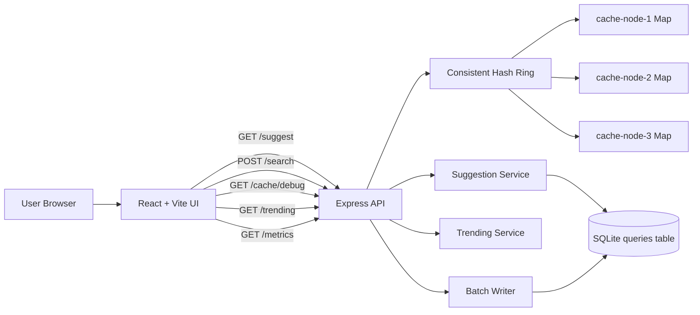

# Architecture

## Overview

SearchIQ is organized as a small, locally reproducible typeahead stack with four layers:

- React frontend for the search input, suggestion dropdown, ranking toggle, and request insights
- Express API for suggestion lookup, search submission, cache inspection, metrics, and trending output
- SQLite database as the local source of truth for `query,count`
- In-memory logical cache nodes coordinated through a consistent-hash ring

The design intentionally favors clarity over infrastructure sprawl. It demonstrates cache-aside reads, prefix-level caching, a rolling one-hour trending window, and write coalescing without requiring external services.

## Architecture Diagram

## Read Path

1. The user types into the search input.
2. The frontend waits for the debounce window before calling `GET /suggest`.
3. The API normalizes the prefix and builds a cache key in the form `<ranking>:<prefix>`.
4. The consistent-hash ring selects the owning logical cache node.
5. On cache hit, the cached ranked response is returned immediately.
6. On cache miss, SQLite is queried, pending in-memory increments are merged, ranking is applied, and the response is written back to the cache.
7. The frontend displays suggestions along with source, cache node, cache status, TTL, and latency metadata.

This is a cache-aside flow: the database remains authoritative, while the cache accelerates repeated prefix lookups.

## Prefix-Level Cache

The cache is keyed by ranking mode and normalized prefix:

- `basic:iph`
- `trending:iph`

Why prefix-level caching is used:

- Typeahead workloads repeat short prefixes heavily
- The prefix is the natural lookup unit for autocomplete
- Cached results can be reused across many users and requests

Each cache entry has:

- a logical owner chosen by consistent hashing
- a TTL
- ranking-specific contents

`POST /search` invalidates affected prefixes in both basic and trending mode so subsequent reads can refresh from the source of truth.

## Consistent Hashing

The project uses a consistent-hash ring with virtual nodes:

- each logical cache node appears multiple times on the ring
- the cache key is hashed
- the next clockwise virtual node owns that key

This keeps the demonstration simple while still showing how key ownership can be distributed across logical nodes.

This remains a local simulation. In a larger deployment, Redis Cluster or Memcached would be a better fit for actual distributed caching.

## Ranking Logic

### Basic Ranking

- normalize the prefix
- fetch prefix matches from SQLite
- merge pending buffered increments
- sort by all-time `count DESC`
- return the top 10 results

### Trending Ranking

- normalize the prefix
- fetch a wider candidate set from SQLite
- merge pending buffered increments
- look up recent activity from the rolling one-hour window
- compute `score = allTimeCount + recentCountLastHour * 50`
- sort by `score DESC`, then `count DESC`, then query text
- return the top 10 results

The trending formula is intentionally transparent rather than personalized or model-driven. It keeps historical popularity while allowing recent interest to reshape the order quickly.

## Write Path

1. `POST /search` normalizes the query.
2. The recent-activity service records the event immediately.
3. The batch writer adds the query to an in-memory aggregation buffer instead of writing to SQLite synchronously.
4. Repeated queries are coalesced into one pending increment per normalized query.
5. The buffer flushes on interval or batch threshold.
6. Flushes are executed inside a SQLite transaction.

This reduces write amplification and provides a clear example of write coalescing.

## Trade-offs

- SQLite keeps local setup simple, deterministic, and reliable, but it is not horizontally scalable.
- Logical cache nodes implemented with `Map` objects demonstrate ownership and TTL behavior, but they do not provide true cross-process distribution.
- The in-memory batch buffer improves local write efficiency, but pending increments can be lost if the process exits before flush.
- The ranking strategy is explainable and reproducible, but intentionally does not attempt personalization or ML-based scoring.

## Production Alternatives

If this design were extended beyond the local simulation, reasonable substitutes would be:

- Redis Cluster or Memcached for the cache layer
- a trie, search index, or specialized search engine for larger prefix workloads
- Kafka, Redis Streams, SQS, or a database-backed queue for durable write buffering
- broader observability and scaling controls around the API layer
