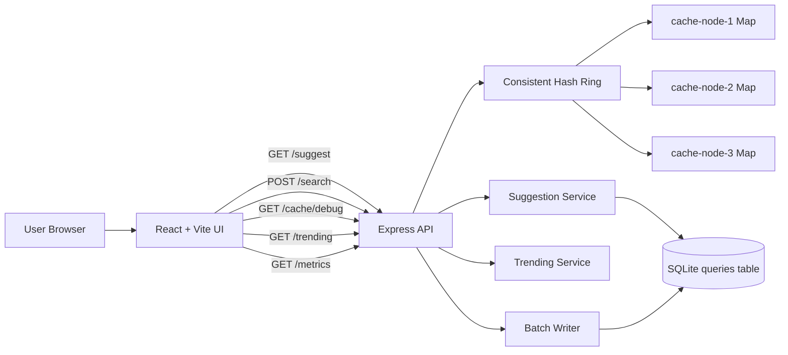

# Architecture

## Overview

This project implements a search typeahead system with four main pieces:

- React frontend for the search box, suggestion dropdown, signals section, and request insights panel
- Express API for suggestion, search submission, cache debug, trending, and metrics endpoints
- SQLite database as the local source of truth for `query,count`
- In-memory distributed cache simulation using logical cache nodes and consistent hashing

## Mermaid Diagram



## End-to-End Request Flow

1. The user types into the React search box.
2. The frontend waits for a 280ms debounce.
3. The UI calls `GET /suggest?q=<prefix>&ranking=<mode>`.
4. The backend normalizes the prefix and asks the consistent-hash ring which cache node owns it.
5. On cache hit, cached suggestions are returned immediately.
6. On cache miss, the backend queries SQLite, merges any unflushed batch increments, ranks results, caches the response, and returns it.
7. The frontend shows suggestions plus request metadata such as cache source, node, cache status, TTL, and latency.

## Suggestion API Flow

### Basic Ranking

- Normalize prefix to lowercase
- Find matching rows where `normalized_query` starts with the prefix
- Sort by all-time `count DESC`
- Return top 10

### Trending Ranking

- Normalize prefix to lowercase
- Fetch a wider candidate set from SQLite
- Merge unflushed batch increments
- Look up recent activity from the rolling window
- Compute `score = allTimeCount + recentCountLastHour * trendingBoost`
- Sort by `score DESC`, then `count DESC`, then query text
- Return top 10

## Cache Flow

- Cache key format: `<ranking>:<prefix>`
- Example: `basic:iph`
- The consistent-hash ring maps each key to one logical cache node
- Each node stores entries in a local `Map`
- Each cache entry has a TTL
- `POST /search` invalidates cached prefixes for the searched query in both `basic` and `trending` modes

Why prefix-level caching is used:

- users often type the same short prefixes
- cache entries are reusable across many users
- the prefix itself is the natural lookup unit for autocomplete

## Consistent Hashing Explanation

The project uses a simple consistent-hash ring with virtual nodes:

- each logical cache node appears multiple times on the ring
- a cache key is hashed
- the next clockwise node owns the key

Why this is useful in the assignment:

- the same prefix reliably maps to the same cache node
- it demonstrates how distributed caches can partition keys
- virtual nodes give a more even distribution without adding much complexity

This is explicitly a simulation. Real Redis Cluster or Memcached infrastructure is not required for this assignment.

## Trending Ranking Flow

- `POST /search` records the normalized query in the trending service
- the trending service stores timestamps in a rolling one-hour window
- old timestamps expire automatically when the query is read again
- the ranking formula is:

```text
score = allTimeCount + recentCountLastHour * 50
```

Why this formula is easy to explain:

- all-time count preserves historical popularity
- recent count surfaces fresh interest
- the fixed boost is simple to explain during the submission demo

## Batch-Write Flow

1. `POST /search` normalizes the query.
2. The query is added to an in-memory aggregation buffer instead of updating SQLite immediately.
3. Repeated queries are merged into one pending increment.
4. The buffer flushes every 5 seconds or when the configured batch size is reached.
5. Flush writes are applied inside a SQLite transaction.
6. Metrics report submissions, pending buffered writes, flushes, writes avoided, and write reduction.

## Key Trade-offs

- SQLite keeps the project local, predictable, and easy to demo.
- Prefix range queries are simple and sufficient for 100k records.
- In-memory caching and batching are easy to understand but not durable across process restarts.
- The trending formula is intentionally simple instead of ML-based or personalized.

## Future Improvements (Not Implemented)

If this assignment needed to scale beyond the local demo, reasonable next steps would be:

- Redis Cluster instead of in-memory cache maps
- trie/search index for larger datasets
- durable queue such as Kafka, Redis Streams, or SQS for write buffering
- read replicas and better observability
