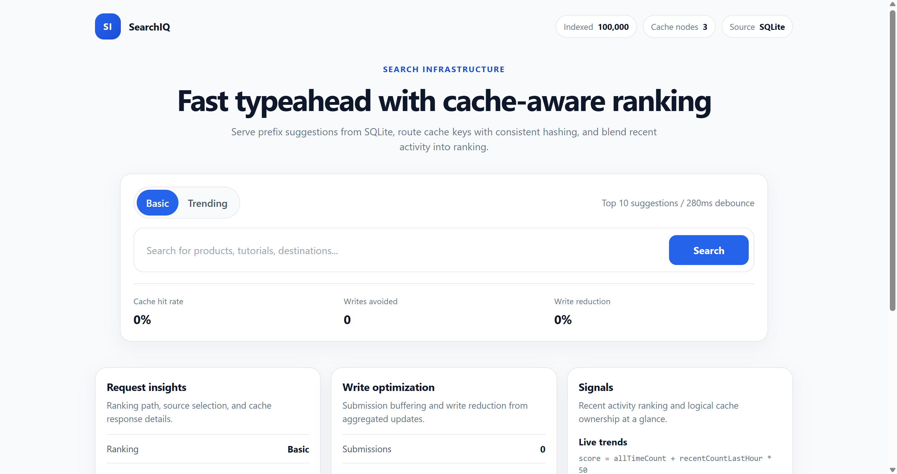
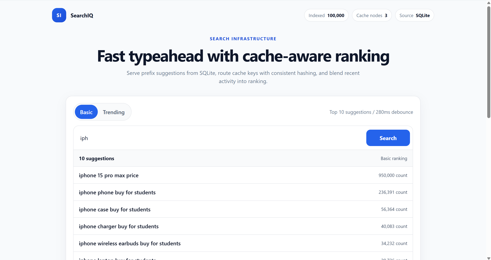
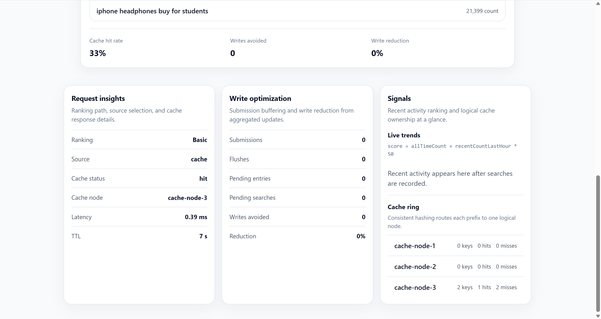
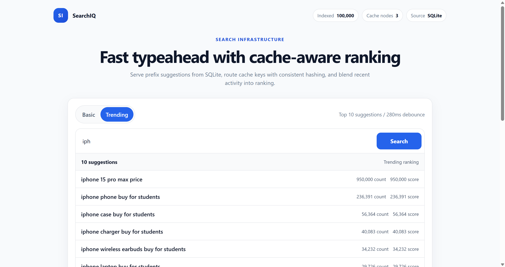
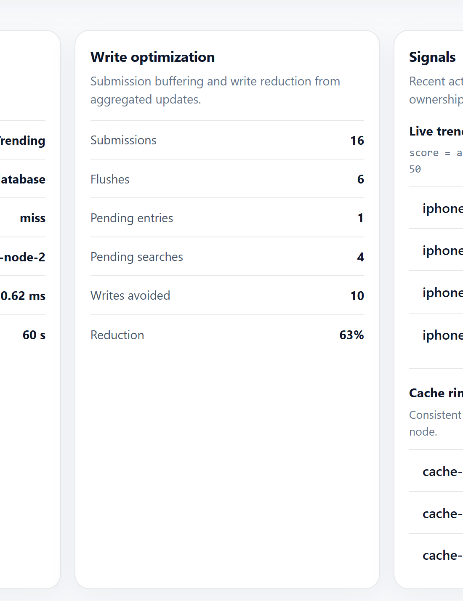

<!DOCTYPE html>
<html lang="en">
<head>
  <meta charset="utf-8" />
  <title>SearchIQ Typeahead Project Report</title>
  
</head>
<body>
  <section class="hero">
    
Project Report

    <h1>SearchIQ Typeahead System</h1>
    

      Consolidated report for a locally reproducible search typeahead system. It covers the architecture,
      deterministic dataset and loading flow, API surface, design trade-offs, performance results,
      screenshot evidence, and validation outcomes in one submission-ready document.
    

    

      

        Runtime
        <strong>Node.js 24+</strong>
      

      

        Primary data size
        <strong>100,000 queries</strong>
      

      

        Local source of truth
        <strong>SQLite</strong>
      

      

        Logical cache nodes
        <strong>3 nodes</strong>
      

    

  </section>

  <h2>1. Executive Summary</h2>
  

    SearchIQ is a locally runnable typeahead/autocomplete system built to demonstrate four ideas together:
    fast prefix suggestions, cache-aside reads, trending ranking based on recent activity, and batched
    database writes that reduce write amplification.
  

  

    The system is intentionally locally reproducible. SQLite is the source of truth, in-memory
    <code>Map</code> objects simulate a distributed cache, consistent hashing decides which logical node
    owns a prefix, and an in-memory batch buffer aggregates repeated searches before writing them to the
    database. The implementation is small enough to explain clearly during review while still covering
    the required system-design concepts.
  

  <h2>2. Architecture Overview</h2>
  

    The application has four main layers: a React frontend, an Express API, a SQLite data store, and a
    distributed-cache simulation. The API is responsible for prefix lookup, ranking mode selection,
    cache-aside reads, trending-window tracking, and batched updates.
  

  <h3>Architecture Diagram</h3>
  <pre>User Browser (React + Vite UI)
        |
        | GET /suggest, POST /search, GET /cache/debug, GET /trending, GET /metrics
        v
Express API (createApp.js)
        |
        +--> SuggestionService --------------------------+
        |                                                |
        |                                                v
        |                                      SQLite queries table
        |                                                ^
        |                                                |
        +--> BatchWriter --> aggregated flushes ---------+
        |
        +--> TrendingService --> rolling one-hour activity window
        |
        +--> ConsistentHashRing --> cache-node-1 / cache-node-2 / cache-node-3
</pre>

  <h3>End-to-End Suggestion Flow</h3>
  <ol>
    <li>The user types into the search box and the UI waits for a 280ms debounce.</li>
    <li>The frontend calls <code>GET /suggest?q=&lt;prefix&gt;&amp;ranking=&lt;mode&gt;</code>.</li>
    <li>The backend normalizes the prefix and asks the consistent-hash ring which logical cache node owns that key.</li>
    <li>If the cache entry is valid, the API returns the cached suggestion list immediately.</li>
    <li>If the cache entry is missing or expired, the API reads from SQLite, merges pending batch increments, ranks the results, caches the response, and returns it.</li>
    <li>The UI shows suggestions and evidence metadata such as ranking mode, source, cache status, cache node, latency, and TTL.</li>
  </ol>

  

    

      <h3>Cache Strategy</h3>
      

        Cache keys use the format <code>&lt;ranking&gt;:&lt;prefix&gt;</code>, for example
        <code>basic:iph</code> or <code>trending:iph</code>. Prefix-level caching is appropriate because
        repeated short prefixes are common in autocomplete workloads.
      

    

    

      <h3>Write Strategy</h3>
      

        <code>POST /search</code> records trending activity immediately, then places the query into an
        aggregation buffer instead of writing synchronously to SQLite. The flush happens periodically or
        when the configured batch size is reached.
      

    

  

  <h2>3. Dataset Source and Loading Instructions</h2>
  

    No external dataset download is required. The 100,000-row CSV is generated locally by
    <code>src/scripts/generateDataset.js</code> and ingested by <code>src/scripts/ingestDataset.js</code>.
    The dataset format is exactly <code>query,count</code>.
  

  

    The generated dataset is deterministic and reproducible. Query strings come from fixed template groups
    (products, travel, coding, food, and common head queries), and counts are derived from a deterministic
    pseudo-random curve rather than live network data. Re-running the same seed script produces the same
    dataset size and the same generation logic every time.
  

  <h3>Load Commands</h3>
  <table class="mapping-table">
    <thead>
      <tr>
        <th>Command</th>
        <th>Purpose</th>
      </tr>
    </thead>
    <tbody>
      <tr>
        <td><code>npm run seed:small</code></td>
        <td>Generate and ingest a 5,000-row development dataset for quick local resets.</td>
      </tr>
      <tr>
        <td><code>npm run seed</code></td>
        <td>Generate and ingest the full 100,000-row dataset used for the final report and submission checks.</td>
      </tr>
    </tbody>
  </table>

  <h3>Loading Behavior</h3>
  <ul>
    <li>CSV generation logs start, progress, and completion.</li>
    <li>SQLite schema initialization is logged separately.</li>
    <li>Ingestion uses bulk upserts inside a SQLite transaction.</li>
    <li>Progress is reported every 10,000 rows for the full seed.</li>
    <li>Generated CSV files and SQLite database files are local build artifacts and should not be included in the final submission ZIP.</li>
  </ul>

  <h2>4. API Documentation</h2>
  

    The API is intentionally small and focused on the documented requirements. All endpoints are implemented
    in <code>src/api/createApp.js</code> and documented in more detail in <code>docs/api.md</code>.
  

  <table>
    <thead>
      <tr>
        <th>Method</th>
        <th>Route</th>
        <th>Purpose</th>
        <th>Key behavior</th>
      </tr>
    </thead>
    <tbody>
      <tr>
        <td>GET</td>
        <td><code>/suggest?q=&lt;prefix&gt;</code></td>
        <td>Return up to 10 prefix suggestions using basic ranking.</td>
        <td>Case-insensitive prefix match, ordered by <code>count DESC</code>, cache checked before database.</td>
      </tr>
      <tr>
        <td>GET</td>
        <td><code>/suggest?q=&lt;prefix&gt;&amp;ranking=trending</code></td>
        <td>Return up to 10 suggestions using recency-aware ranking.</td>
        <td>Uses <code>score = allTimeCount + recentCountLastHour * 50</code>.</td>
      </tr>
      <tr>
        <td>POST</td>
        <td><code>/search</code></td>
        <td>Record a submitted search.</td>
        <td>Returns <code>{ "message": "Searched" }</code>, updates recent activity, invalidates prefixes, and adds the query to the batch buffer.</td>
      </tr>
      <tr>
        <td>GET</td>
        <td><code>/cache/debug?prefix=&lt;prefix&gt;</code></td>
        <td>Expose cache ownership and TTL information for a prefix.</td>
        <td>Shows normalized key, assigned node, hit/miss/expired status, and remaining TTL.</td>
      </tr>
      <tr>
        <td>GET</td>
        <td><code>/trending?limit=&lt;n&gt;</code></td>
        <td>Return the current trending query list.</td>
        <td>Includes rolling-window metadata and score-ready suggestions.</td>
      </tr>
      <tr>
        <td>GET</td>
        <td><code>/metrics</code></td>
        <td>Return cache, batch-writer, and database metrics.</td>
        <td>Used for cache hit rate, write-reduction evidence, and demo reporting.</td>
      </tr>
    </tbody>
  </table>

  <h3>Representative Responses</h3>
  <pre>GET /suggest?q=iph
{
  "query": "iph",
  "ranking": "basic",
  "source": "database",
  "cacheStatus": "miss",
  "cacheNode": "cache-node-3",
  "suggestions": [
    {
      "query": "iphone 15 pro max price",
      "count": 950000
    }
  ]
}

POST /search
{
  "message": "Searched"
}</pre>

  <h2>5. Design Choices and Trade-offs</h2>
  <table>
    <thead>
      <tr>
        <th>Design area</th>
        <th>Chosen implementation</th>
        <th>Reason for this approach</th>
        <th>Trade-off</th>
      </tr>
    </thead>
    <tbody>
      <tr>
        <td>Primary data store</td>
        <td>SQLite via <code>node:sqlite</code></td>
        <td>Simple, local, deterministic, and easy to run on a laptop.</td>
        <td>Not horizontally scalable like a production database service.</td>
      </tr>
      <tr>
        <td>Cache layer</td>
        <td>Three logical <code>Map</code>-based cache nodes</td>
        <td>Demonstrates distributed ownership, prefix caching, TTL, and invalidation without external services.</td>
        <td>Cache state is local to the process and not shared across real machines.</td>
      </tr>
      <tr>
        <td>Partitioning</td>
        <td>Consistent hash ring with virtual nodes</td>
        <td>Shows how prefixes can map predictably to logical cache owners.</td>
        <td>Still a simulation, not a full Redis Cluster implementation.</td>
      </tr>
      <tr>
        <td>Trending logic</td>
        <td>Rolling one-hour activity window with fixed boost</td>
        <td>Easy to explain and visibly changes ranking during a demo.</td>
        <td>Not personalized and not ML-driven.</td>
      </tr>
      <tr>
        <td>Write path</td>
        <td>In-memory aggregated batch buffer</td>
        <td>Reduces write amplification and demonstrates batched persistence.</td>
        <td>Buffered increments can be lost if the process exits before flush.</td>
      </tr>
    </tbody>
  </table>

  

    Production alternatives are documented as alternatives only, not as implemented scope. For example:
    Redis Cluster would replace the local cache simulation, a trie or search index could replace SQL prefix
    range queries for much larger datasets, and a durable queue such as Kafka, Redis Streams, or SQS could
    replace the in-memory batch buffer. Those options are intentionally not implemented here because the
    project is focused on local clarity and explainability.
  

  <h2>6. Performance Report</h2>
  

    Performance measurements below were collected on the local Windows environment used for final
    validation. These are measured values from the current implementation, not placeholders.
  

  <h3>Seed Performance</h3>
  <table>
    <thead>
      <tr>
        <th>Command</th>
        <th>Rows inserted</th>
        <th>CSV generation</th>
        <th>Ingestion</th>
        <th>Total duration</th>
      </tr>
    </thead>
    <tbody>
      <tr>
        <td><code>npm run seed:small</code></td>
        <td>5,000</td>
        <td>55ms</td>
        <td>870ms</td>
        <td>975ms</td>
      </tr>
      <tr>
        <td><code>npm run seed</code></td>
        <td>100,000</td>
        <td>546ms</td>
        <td>4323ms</td>
        <td>4879ms</td>
      </tr>
    </tbody>
  </table>

  <h3>Suggest Benchmark</h3>
  

    A low-risk benchmark helper was added at <code>src/scripts/benchmarkSuggest.js</code>. It calls the
    already-running API and reports cold and warm latencies plus cache hit rate without changing backend
    behavior or API contracts.
  

  <table>
    <thead>
      <tr>
        <th>Measurement</th>
        <th>Measured value</th>
      </tr>
    </thead>
    <tbody>
      <tr>
        <td>Cold <code>/suggest?q=iph</code></td>
        <td>10.94ms wall-clock, 6.25ms API-reported latency</td>
      </tr>
      <tr>
        <td>Warm <code>/suggest?q=iph</code> p95 over 25 requests</td>
        <td>3.28ms wall-clock, 0.22ms API-reported latency</td>
      </tr>
      <tr>
        <td>Warm <code>/suggest?q=iph&amp;ranking=trending</code> p95 over 25 requests</td>
        <td>2.05ms wall-clock, 0.18ms API-reported latency</td>
      </tr>
      <tr>
        <td>Cache hit rate after warm-up</td>
        <td>96%</td>
      </tr>
    </tbody>
  </table>

  

    These measurements support the core claim of the design: repeated autocomplete prefixes are a strong
    fit for prefix-level caching, and the batched write path keeps ingestion and update costs well within
    the performance target.
  

  <h2>7. Requirement-to-Implementation Mapping</h2>
  <h3>Core Functional Requirements</h3>
  <table class="mapping-table">
    <thead>
      <tr>
        <th>Requirement</th>
        <th>Implementation</th>
        <th>Evidence / file</th>
      </tr>
    </thead>
    <tbody>
      <tr>
        <td>100,000 dataset in <code>query,count</code> format</td>
        <td>Deterministic CSV generator plus bulk ingestion</td>
        <td><code>src/scripts/generateDataset.js</code>, <code>src/scripts/ingestDataset.js</code>, <code>npm run seed</code></td>
      </tr>
      <tr>
        <td>Search UI with suggestion dropdown and debounce</td>
        <td>React search module with 280ms debounce, keyboard navigation, and inline evidence</td>
        <td><code>src/App.jsx</code>, <code>src/styles/app.css</code></td>
      </tr>
      <tr>
        <td><code>GET /suggest?q=&lt;prefix&gt;</code></td>
        <td>Basic prefix lookup with top 10 results sorted by count descending</td>
        <td><code>src/api/createApp.js</code>, <code>src/services/suggestionService.js</code>, tests</td>
      </tr>
      <tr>
        <td><code>POST /search</code> and query-count updates</td>
        <td>Returns <code>{ "message": "Searched" }</code>, records recent activity, buffers DB updates</td>
        <td><code>src/services/searchService.js</code>, <code>src/services/batchWriter.js</code>, tests</td>
      </tr>
      <tr>
        <td>Cache-before-database flow</td>
        <td>Distributed cache checked before SQLite query execution</td>
        <td><code>src/services/suggestionService.js</code>, screenshots, tests</td>
      </tr>
      <tr>
        <td>Prefix-level cache entries with expiry and invalidation</td>
        <td>Key format <code>&lt;ranking&gt;:&lt;prefix&gt;</code>, TTL, and prefix invalidation on search</td>
        <td><code>src/services/distributedCache.js</code>, <code>src/services/searchService.js</code></td>
      </tr>
      <tr>
        <td>Multiple logical cache nodes with consistent hashing</td>
        <td>Three logical cache nodes with a consistent-hash ring and virtual nodes</td>
        <td><code>src/services/consistentHashRing.js</code>, <code>src/services/distributedCache.js</code>, tests</td>
      </tr>
      <tr>
        <td><code>GET /cache/debug?prefix=&lt;prefix&gt;</code></td>
        <td>Returns normalized prefix, owning node, TTL, and node stats</td>
        <td><code>src/api/createApp.js</code>, screenshots, tests</td>
      </tr>
      <tr>
        <td>Trending searches with recency-aware ranking</td>
        <td>One-hour window and formula <code>score = allTimeCount + recentCountLastHour * 50</code></td>
        <td><code>src/services/trendingService.js</code>, <code>src/services/suggestionService.js</code>, tests</td>
      </tr>
      <tr>
        <td>Batch writes with repeated-query aggregation</td>
        <td>In-memory aggregation buffer, flush interval, size-based flush, SQLite transaction writes</td>
        <td><code>src/services/batchWriter.js</code>, <code>src/db/database.js</code>, tests</td>
      </tr>
    </tbody>
  </table>

  <h3>Design and Performance Evidence</h3>
  <table class="mapping-table">
    <thead>
      <tr>
        <th>Requirement area</th>
        <th>Implementation / explanation</th>
        <th>Evidence / file</th>
      </tr>
    </thead>
    <tbody>
      <tr>
        <td>Write-reduction evidence and performance reporting</td>
        <td>Metrics endpoint, performance report, benchmark helper</td>
        <td><code>GET /metrics</code>, <code>docs/performance-report.md</code>, <code>src/scripts/benchmarkSuggest.js</code></td>
      </tr>
      <tr>
        <td>Architecture explanation and data flow</td>
        <td>Frontend, API, cache ring, recent-activity window, and SQLite write path are documented with a diagram and step-by-step request flow.</td>
        <td><code>docs/architecture.md</code>, Section 2 of this report</td>
      </tr>
      <tr>
        <td>Dataset source and loading instructions</td>
        <td>Deterministic dataset generation, schema setup, transaction-based ingestion, and seed commands are documented for reproducible local setup.</td>
        <td><code>README.md</code>, Section 3 of this report</td>
      </tr>
      <tr>
        <td>API documentation</td>
        <td>Every required endpoint is described with purpose, behavior, and representative response examples.</td>
        <td><code>docs/api.md</code>, Section 4 of this report</td>
      </tr>
      <tr>
        <td>Design choices and trade-offs</td>
        <td>Local SQLite storage, logical cache nodes, consistent hashing, recent-activity boosting, and buffered writes are explained with their trade-offs.</td>
        <td><code>docs/architecture.md</code>, Section 5 of this report</td>
      </tr>
      <tr>
        <td>Screenshot evidence availability</td>
        <td>All submission screenshots are stored in the repository and embedded as compact thumbnail cards in this report.</td>
        <td><code>docs/screenshots/</code>, Section 8 of this report</td>
      </tr>
    </tbody>
  </table>

  <h2>8. Screenshot Evidence</h2>
  

    All screenshots are included in the repository under <code>docs/screenshots/</code>.
  

  

    

      
      
home.png

      
Initial SearchIQ screen with search interface and overview metrics.

    

    

      
      
suggestions.png

      
Prefix suggestions for "iph", showing top matching queries and counts.

    

    

      
      
cache-hit.png

      
Repeated prefix lookup showing cache hit, cache node, latency, and TTL.

    

    

      
      
trending.png

      
Trending mode showing recency-aware ranking and score values.

    

    

      
      
batch-metrics.png

      
Batch-write metrics showing submissions, flushes, writes avoided, and reduction.

    

  

  <h2>9. Testing and Validation</h2>
  

    The final validation sequence focuses on local reproducibility and correctness rather than infrastructure
    complexity.
  

  <table class="mapping-table">
    <thead>
      <tr>
        <th>Command</th>
        <th>Purpose</th>
        <th>Latest result</th>
      </tr>
    </thead>
    <tbody>
      <tr>
        <td><code>npm run seed:small</code></td>
        <td>Validate the fast local seed path and smaller reproducible dataset.</td>
        <td>Pass</td>
      </tr>
      <tr>
        <td><code>npm run seed</code></td>
        <td>Validate the full deterministic 100,000-row dataset load.</td>
        <td>Pass</td>
      </tr>
      <tr>
        <td><code>npm test</code></td>
        <td>Verify API behavior, cache routing, trending ranking, and batch-write logic.</td>
        <td>13/13 tests passed</td>
      </tr>
      <tr>
        <td><code>npm run build</code></td>
        <td>Verify the frontend production build completes successfully.</td>
        <td>Pass</td>
      </tr>
      <tr>
        <td><code>npm run benchmark</code></td>
        <td>Measure cold and warm suggestion latency plus cache hit rate against a running API.</td>
        <td>Cold 10.94ms, warm p95 3.28ms, trending p95 2.05ms, hit rate 96%</td>
      </tr>
    </tbody>
  </table>

  <h2>10. Conclusion</h2>
  

    This submission meets the project scope without unnecessary infrastructure. It provides a 100,000-row
    deterministic dataset, a functional typeahead UI, cache-first suggestion flow, consistent-hash cache
    ownership, trending ranking, batched persistence, screenshot evidence, and measured local performance.
    It is intentionally local-only and explainable, which is appropriate for this submission context.
  

</body>
</html>
